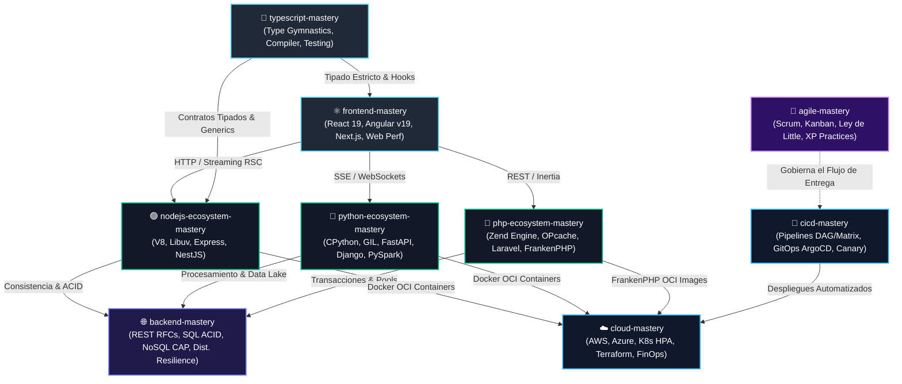

# 🏛️ The Mastery Suite: Software Engineering & Architecture Hub

> **Repositorio Maestro y Centro de Mando** para la consolidación de habilidades desde el código hasta la infraestructura y el liderazgo técnico: **Node.js, TypeScript Avanzado, Python, PHP, Arquitectura Backend, Frontend Moderno, Cloud Platform, CI/CD Universal y Metodologías Ágiles**.

Creado y mantenido por **[@zulquer](https://github.com/zulquer)**.

---

## 🌐 Mapa de la Suite de Especialidades (9 Módulos)



---

## 🖥️ Visualizador Web Interactivo de Entrevistas (1,150 Preguntas)

La suite incluye una aplicación web de alta gama para explorar, filtrar por nivel de seniority (`Junior`, `Mid-Level`, `Senior`, `Staff`), buscar y estudiar en tiempo real las **1,150 preguntas técnicas organizadas por sección**:

```bash
# Lanzar el visualizador interactivo localmente:
make viewer
# O abrir directamente en cualquier navegador:
open _viewer/index.html
```

- 📂 **Organización por Sección**: Cada tecnología dividida en bloques canónicos de 10 preguntas.
- 🔍 **Buscador & Filtros Instantáneos**: Búsqueda por texto en código y respuestas, filtrado por nivel de seniority.
- 🎯 **Criterios de Evaluación**: Banderas destacadas 🚩 *Red Flags* vs 🟢 *Green Flags*.
- 💾 **Persistencia de Progreso**: Registro de preguntas dominadas y favoritas guardado en `localStorage`.

---

## 📦 Los Repositorios Especializados de la Suite

| Repositorio | Especialidad Técnica & Runtimes | 100 Preguntas de Entrevista | Repositorio GitHub |
|---|---|:---:|---|
| **`nodejs-ecosystem-mastery`** | 🟢 **Node.js Core, V8, Libuv, Express, NestJS (100 Labs) & Testing** | [Hub 300 Preguntas](nodejs-ecosystem-mastery/INTERVIEW-QUESTIONS.md) | [github.com/zulquer/nodejs-ecosystem-mastery](https://github.com/zulquer/nodejs-ecosystem-mastery) |
| ↳ *Node.js Core & Runtime* | 🟢 V8 Internals, Libuv Event Loop, Memory Slabs, Backpressure, Workers | [Ver 100 Preguntas](nodejs-ecosystem-mastery/INTERVIEW-QUESTIONS-NODEJS.md) | - |
| ↳ *Express.js Architecture* | ⚡ Onion Middleware, Express 4 vs 5, Security, RFC 7807, Streaming | [Ver 100 Preguntas](nodejs-ecosystem-mastery/INTERVIEW-QUESTIONS-EXPRESS.md) | - |
| ↳ *NestJS Enterprise* | 🦁 IoC, Request Lifecycle, Dynamic Modules, CQRS, Microservices | [Ver 100 Preguntas](nodejs-ecosystem-mastery/INTERVIEW-QUESTIONS-NESTJS.md) | - |
| **`typescript-mastery`** | 🔷 **TypeScript Avanzado, Type Gymnastics, Compiler & Testing** | [Ver 100 Preguntas](typescript-mastery/INTERVIEW-QUESTIONS.md) | *Local / En Suite* |
| **`python-ecosystem-mastery`** | 🐍 **CPython Internals, GIL, FastAPI ASGI, Django ORM, PySpark & Pytest** | [Ver 100 Preguntas](python-ecosystem-mastery/INTERVIEW-QUESTIONS.md) | [github.com/zulquer/python-ecosystem-mastery](https://github.com/zulquer/python-ecosystem-mastery) |
| **`php-ecosystem-mastery`** | 🐘 **Zend Engine 4, Zvals COW, Laravel IoC, Symfony HttpKernel, FrankenPHP** | [Ver 100 Preguntas](php-ecosystem-mastery/INTERVIEW-QUESTIONS.md) | [github.com/zulquer/php-ecosystem-mastery](https://github.com/zulquer/php-ecosystem-mastery) |
| **`backend-mastery`** | 🌐 **REST APIs RFC 9110, SQL (MVCC, SKIP LOCKED), NoSQL & Sistemas Distribuidos** | [Ver 100 Preguntas](backend-mastery/INTERVIEW-QUESTIONS.md) | [github.com/zulquer/backend-mastery](https://github.com/zulquer/backend-mastery) |
| **`frontend-mastery`** | ⚛️ **React 19 (Fiber, Lanes), Angular (Signals, Zoneless), Next.js & Web Vitals** | [Ver 100 Preguntas](frontend-mastery/INTERVIEW-QUESTIONS.md) | [github.com/zulquer/frontend-mastery](https://github.com/zulquer/frontend-mastery) |
| **`cloud-mastery`** | ☁️ **Cloud (AWS, Azure), Kubernetes HPA, Terraform Multi-AZ & FinOps** | [Ver 100 Preguntas](cloud-mastery/INTERVIEW-QUESTIONS.md) | [github.com/zulquer/cloud-mastery](https://github.com/zulquer/cloud-mastery) |
| **`cicd-mastery`** | 🚀 **CI/CD Universal (GitHub Actions, Azure Pipelines), GitOps & Canary** | [Ver 100 Preguntas](cicd-mastery/INTERVIEW-QUESTIONS.md) | [github.com/zulquer/cicd-mastery](https://github.com/zulquer/cicd-mastery) |
| **`agile-mastery`** | 🏃 **Scrum en Profundidad, Flujo Kanban, Ley de Little, XP & Cynefin** | [Ver 100 Preguntas](agile-mastery/INTERVIEW-QUESTIONS.md) | [github.com/zulquer/agile-mastery](https://github.com/zulquer/agile-mastery) |

---

## 🎯 Itinerarios de Carrera Guiados (Learning Paths)

Dependiendo del objetivo profesional o del rol que quieras demostrar en entrevistas técnicas:

### 1. 🌟 Ruta Full-Stack Engineer
- `frontend-mastery` ➔ Dominio de rendering, reconciliación y estado cliente.
- `typescript-mastery` ➔ Type gymnastics, contratos estrictos y calidad en tiempo de compilación.
- `nodejs-ecosystem-mastery` ➔ Desarrollo de APIs resilientes en Node/NestJS.
- `backend-mastery` ➔ Diseño de esquemas SQL, cachés con Redis y contratos RFC.

### 2. ⚡ Ruta Backend & Distributed Data Specialist
- `backend-mastery` ➔ Patrones distribuidos, transacciones ACID y aislamiento.
- `nodejs-ecosystem-mastery` ➔ Alto rendimiento de I/O en V8 y Streams.
- `python-ecosystem-mastery` ➔ Concurrencia CPython, FastAPI y big data con PySpark.

### 3. 🛡️ Ruta Cloud Platform & SRE / DevOps
- `cloud-mastery` ➔ Orquestación de Kubernetes, Elasticidad HPA y Terraform.
- `cicd-mastery` ➔ Automatización de despliegues Zero-Downtime y GitOps.
- `backend-mastery` ➔ Observabilidad, Rate Limiting y Resiliencia ante fallos.

### 4. 👑 Ruta Tech Lead & Staff Engineer
- **Visión 360°**: Dominar las 8 áreas técnicas anteriores sumadas a `agile-mastery` para erradicar la multitarea mediante la Ley de Little, acortar el Lead Time y alinear negocio e ingeniería.

---

## ⚡ Centro de Mando: Comandos Rápidos

Desde la raíz del repositorio padre:

```bash
# 1. Comprobar el estado de Git en los 9 módulos de la suite:
make status

# 2. Ejecutar la suite completa de los 9 laboratorios senior:
make test-all

# 3. Compilar las 1,150 preguntas desde los repositorios hacia el visualizador:
make build-viewer
# o con npm:
npm run build:questions

# 4. Abrir el visualizador web interactivo:
make viewer

# 5. Actualizar todos los submódulos desde GitHub:
make update
```

---

## 🏛️ Estándares Universales y Buenas Prácticas

Toda la suite implementa transversalmente:
- **The Twelve-Factor App**: Configuración por entorno, paridad dev/prod, procesos sin estado y logs como streams.
- **Métricas DORA**: Optimización de frecuencia de despliegue, tiempo de entrega de cambios, MTTR y tasa de fallos.
- **Clean Architecture & SOLID**: Inversión de control, arquitectura hexagonal y separación estricta de responsabilidades.
